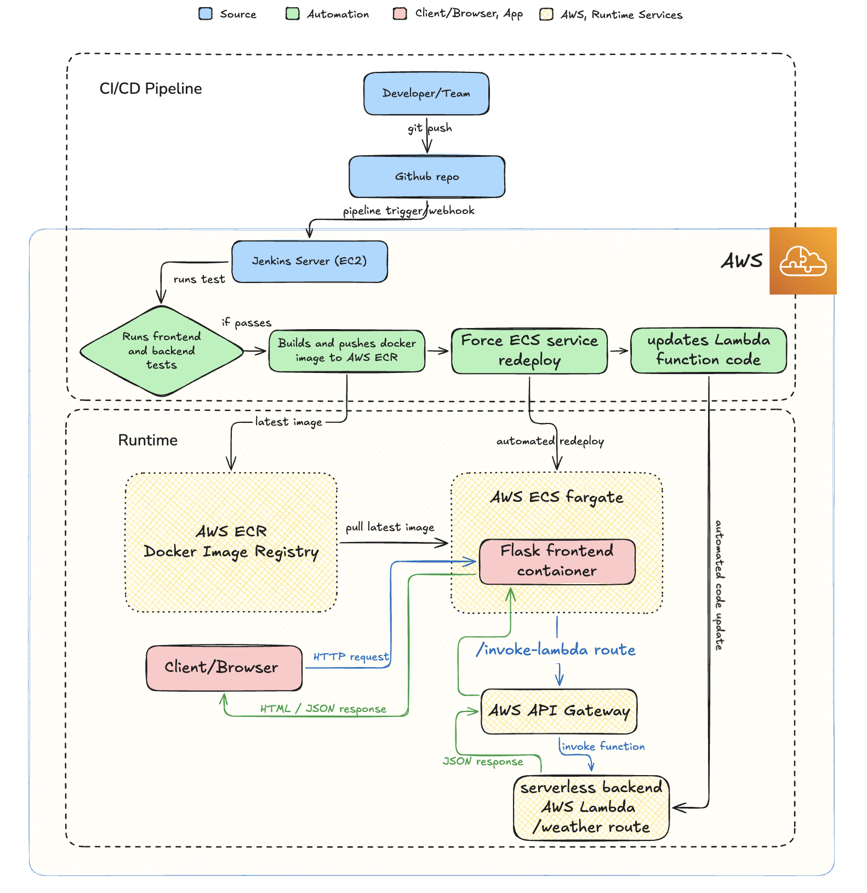

# This is a collaborative CICD project by Lina and Jay

## Project Overview

This project is a small cloud application built to practise modern DevOps and AWS deployment patterns.

The aim is to build a simple but realistic end-to-end CI/CD workflow using GitHub, Jenkins, Docker, Fargate, API Gateway, and Lambda.

## Project goal

The goal of this project was to build and deploy a small cloud-native application with:

- a **frontend Flask application** running in a container on **AWS ECS Fargate**
- a **serverless backend** running on **AWS Lambda**
- **Amazon API Gateway** in front of the Lambda
- **Jenkins** to automate testing and deployment through a CI/CD pipeline
- **GitHub** as the source code repository

In short, the aim was to prove a full workflow where code changes in GitHub can be tested and deployed automatically to both the containerised frontend and the serverless backend.

---

## Deployment and CI/CD diagram

The diagram below shows the deployment architecture and the CI/CD pipeline for the project. The frontend Flask application runs on Amazon ECS Fargate, the backend is provided by AWS Lambda through Amazon API Gateway, and Jenkins automates testing and deployment from GitHub.



And the delivery pipeline became:

```text
GitHub
   ↓
Jenkins
   ├─ Run frontend and backend tests
   ├─ Build and push Docker image to Amazon ECR
   ├─ Force ECS service redeployment
   └─ Update Lambda function code
```

---

## Final project tree structure

```text
serverless_cicd_project/
├── backend/
│   ├── lambda_function.py
│   └── tests/
├── frontend/
│   ├── app.py
│   ├── Dockerfile
│   ├── requirements.txt
│   ├── start.sh
│   ├── templates/
│   └── tests/
├── Jenkinsfile
├── lina-jay-jenkins-stack.json
└── README.md
```

Also make sure you have a `.gitignore` that excludes local-only files such as:

```gitignore
venv/
__pycache__/
*.pyc
.pytest_cache/
.DS_Store
```

---

## End-to-end develpement to deployment step-by-step guide 

## Step 1: Prepare the codebase

We started with a Flask app and restructured it so the project clearly separated:

- `frontend/` for the Flask app and Dockerfile
- `backend/` for the Lambda function
- `Jenkinsfile` at repo root

### Frontend responsibilities
- serve HTML pages
- expose `/quote`
- expose `/lambda`
- expose `/invoke-lambda` as a JSON endpoint for the JS page

### Backend responsibilities
- Lambda returns weather information as JSON

---

## Step 2: Create and test the Lambda function locally

The backend Lambda was created as a Python function with static weather data.

Example shape:

```python
import json

WEATHER = {
    "london": {
        "city": "London",
        "condition": "Cloudy with light rain",
        "temperature": "12°C",
        "humidity": "78%",
        "wind": "15 mph SW"
    }
}

def lambda_handler(event, context):
    params = event.get("queryStringParameters") or {}
    city = params.get("city", "london").strip().lower()

    weather = WEATHER.get(city)

    if not weather:
        return {
            "statusCode": 400,
            "headers": {"Access-Control-Allow-Origin": "*"},
            "body": json.dumps({
                "skill": "tell_weather",
                "message": f"Sorry, I don't have weather data for {city}."
            })
        }

    return {
        "statusCode": 200,
        "headers": {"Access-Control-Allow-Origin": "*"},
        "body": json.dumps({
            "skill": "tell_weather",
            "message": (
                f"The weather in {weather['city']} is currently {weather['condition']}. "
                f"Temperature: {weather['temperature']}, "
                f"Humidity: {weather['humidity']}, "
                f"Wind: {weather['wind']}."
            )
        })
    }
```

### Local backend tests
Write pytest tests in `backend/tests/`.

We used a `sys.path` trick to import `lambda_function.py` correctly from the test directory.

---

## Step 3: Fix and test the Flask frontend locally

The frontend `app.py` was updated to support the JS demo page.

Final logic:
- `/quote` returns a random quote as JSON
- `/lambda` renders `lambda.html`
- `/invoke-lambda` accepts a JSON body from `fetch()`
- Flask then calls API Gateway using Python and returns JSON back to the page

### Final frontend flow
The `lambda.html` page uses JavaScript to:
- select a city
- call `/invoke-lambda`
- display the Lambda response in the response box

### Important environment variable
The frontend needs:

```text
LAMBDA_WEATHER_URL=https://YOUR_API_ID.execute-api.eu-west-2.amazonaws.com/weather
```

### Local test
Run:

```bash
export LAMBDA_WEATHER_URL="https://YOUR_API_ID.execute-api.eu-west-2.amazonaws.com/weather"
python frontend/app.py
```

Then open:

```text
http://127.0.0.1:5000/lambda
```

The weather button should work locally.

---

## Step 4: Build and test the Docker image locally

Because the frontend runs on Fargate, it needed to be containerised.

### Build command
On Mac, especially Apple Silicon, we used:

```bash
docker build --platform linux/amd64 -t lina-jay-weather-app ./frontend
```

This ensures the image is built for the Linux architecture expected by ECS/Fargate.

### Why this mattered
The local machine was macOS, but the runtime environment on AWS is Linux.

---

## Step 5: Create ECR and push the image

### Create an ECR repository
In AWS Console:
- go to ECR
- create a private repository
- repo name: `lina-jay-weather-app`

### Configure AWS CLI
AWS CLI was configured using access keys.

### Log in to ECR
Example:

```bash
aws ecr get-login-password --region eu-west-2 | docker login --username AWS --password-stdin 664047078509.dkr.ecr.eu-west-2.amazonaws.com
```

### Tag and push the image
```bash
docker tag lina-jay-weather-app:latest 664047078509.dkr.ecr.eu-west-2.amazonaws.com/lina-jay-weather-app:latest
docker push 664047078509.dkr.ecr.eu-west-2.amazonaws.com/lina-jay-weather-app:latest
```

---

## Step 6: Create ECS/Fargate frontend infrastructure

The frontend deployment used:

- **ECR** to store the image
- **ECS cluster**
- **Task definition**
- **ECS service**

### Key task definition settings
- launch type: `Fargate`
- OS: `Linux`
- network mode: `awsvpc`
- container port: `5000`
- image URI: from ECR

### Service
The ECS service was created without a load balancer initially, using:
- public IP enabled
- security group allowing access to the app port

---

## Step 7: Add environment variable to ECS

Once API Gateway was created, the frontend in ECS needed to know the backend URL.

So a new task definition revision was created with:

- key: `LAMBDA_WEATHER_URL`
- value: `https://5qh6mm5hsk.execute-api.eu-west-2.amazonaws.com/weather`

Then the ECS service was updated to use that new revision.

Without this step, the frontend would show:

```text
LAMBDA_WEATHER_URL environment variable not set
```

---

## Step 8: Set up Jenkins on EC2

A Jenkins server was created on EC2 using CloudFormation.

### Key steps
1. Create an EC2 key pair
2. Save the `.pem` file
3. Move it into `~/.ssh/`
4. Set permissions:

```bash
chmod 400 ~/.ssh/lina-jay-jenkins.pem
```

### CloudFormation stack
A provided JSON template was used to create:
- VPC
- subnet
- internet gateway
- security group
- IAM role
- EC2 instance with Jenkins

### SSH into the server
```bash
ssh -i ~/.ssh/lina-jay-jenkins.pem ec2-user@<INSTANCE_DNS>
```

Then check Jenkins:
```bash
sudo systemctl status jenkins
```

---

## Step 9: Configure Jenkins

After unlocking Jenkins:
- install suggested plugins
- create admin user
- create a new Pipeline job
- point it at the GitHub repo
- set script path to `Jenkinsfile`

---

## Step 10: Build the Jenkins pipeline incrementally

We did not jump to the full deployment pipeline immediately.

We built it in stages:

### First version
- check Python
- install dependencies
- run frontend tests
- run backend tests
- build Docker image

### Then add AWS check
```groovy
sh 'aws sts get-caller-identity'
```

This confirmed Jenkins could authenticate to AWS via the EC2 instance role.

### Then add ECR stages
- login to ECR
- tag image
- push image

### Then add ECS redeploy
```groovy
aws ecs update-service --cluster ... --service ... --force-new-deployment
```

### Finally add Lambda deployment
Zip the backend code and deploy it:

```groovy
stage('Deploy Lambda') {
    steps {
        dir('backend') {
            sh '''
            rm -f function.zip
            zip function.zip lambda_function.py
            aws lambda update-function-code \
            --function-name lina-jay-weather-lambda \
            --zip-file fileb://function.zip \
            --region $AWS_REGION
            '''
        }
    }
}
```

---

## Final Jenkinsfile

This was the working full pipeline:

```groovy
pipeline {
    agent any

    environment {
        AWS_REGION = 'eu-west-2'
        AWS_ACCOUNT_ID = '664047078509'
        ECR_REPO = 'lina-jay-weather-app'
        IMAGE_TAG = 'latest'
    }

    stages {

        stage('Set up Python') {
            steps {
                sh 'python3 --version'
                sh 'pip3 --version'
            }
        }

        stage('Install frontend dependencies') {
            steps {
                dir('frontend') {
                    sh 'pip3 install -r requirements.txt'
                }
            }
        }

        stage('Install test dependencies') {
            steps {
                sh 'pip3 install pytest'
            }
        }

        stage('Run frontend tests') {
            steps {
                sh 'python3 -m pytest frontend/tests'
            }
        }

        stage('Run backend tests') {
            steps {
                sh 'python3 -m pytest backend/tests'
            }
        }

        stage('Build frontend image') {
            steps {
                dir('frontend') {
                    sh 'docker build --platform linux/amd64 -t $ECR_REPO:$IMAGE_TAG .'
                }
            }
        }

        stage('Check AWS access') {
            steps {
                sh 'aws sts get-caller-identity'
            }
        }

        stage('Login to ECR') {
            steps {
                sh '''
                aws ecr get-login-password --region $AWS_REGION | \
                docker login --username AWS --password-stdin \
                $AWS_ACCOUNT_ID.dkr.ecr.$AWS_REGION.amazonaws.com
                '''
            }
        }

        stage('Tag image for ECR') {
            steps {
                sh '''
                docker tag $ECR_REPO:$IMAGE_TAG \
                $AWS_ACCOUNT_ID.dkr.ecr.$AWS_REGION.amazonaws.com/$ECR_REPO:$IMAGE_TAG
                '''
            }
        }

        stage('Push image to ECR') {
            steps {
                sh '''
                docker push \
                $AWS_ACCOUNT_ID.dkr.ecr.$AWS_REGION.amazonaws.com/$ECR_REPO:$IMAGE_TAG
                '''
            }
        }

        stage('Deploy Lambda') {
            steps {
                dir('backend') {
                    sh '''
                    rm -f function.zip
                    zip function.zip lambda_function.py
                    aws lambda update-function-code \
                    --function-name lina-jay-weather-lambda \
                    --zip-file fileb://function.zip \
                    --region $AWS_REGION
                    '''
                }
            }
        }

        stage('Deploy to ECS') {
            steps {
                sh '''
                aws ecs update-service \
                --cluster lina-jay-weather-app-ecs \
                --service lina-jay-weather-app-task-service-423ul5x4 \
                --force-new-deployment \
                --region $AWS_REGION
                '''
            }
        }
    }
}
```

---

## Blockers we came accross and fixes 

## Blocker 1: test import errors in backend
### Problem
Pytest could not find `lambda_function.py`.

### Fix
Add parent directory to `sys.path` in backend tests:

```python
import sys
import os
sys.path.insert(0, os.path.abspath(os.path.join(os.path.dirname(__file__), '..')))
from lambda_function import lambda_handler
```

---

## Blocker 2: frontend/backend structure unclear
### Problem
Originally the repo was one flat Flask project and did not reflect the final architecture.

### Fix
Restructure into:
- `frontend/`
- `backend/`
- root `Jenkinsfile`

---

## Blocker 3: `/quote` vs `/quotes` confusion
### Problem
At one point the route and tests were inconsistent.

### Fix
Use one consistent route. In this project the chosen route was:

```python
@app.route('/quote')
```

and tests were aligned to that.

---

## Blocker 4: `pytest: command not found` in Jenkins
### Problem
Jenkins installed pytest but the executable was not on `PATH`.

### Fix
Run pytest through Python:

```groovy
sh 'python3 -m pytest frontend/tests'
sh 'python3 -m pytest backend/tests'
```

---

## Blocker 5: Jenkinsfile brace nesting errors
### Problem
New stages were accidentally nested inside other stages.

### Fix
Close each stage properly and keep stages as siblings inside `stages { ... }`.

---

## Blocker 6: Lambda test still returned “Hello from Lambda!”
### Problem
The default AWS sample code was still active.

### Fix
Paste the weather code into Lambda and click **Deploy** before testing again.

---

## Blocker 7: confusion finding API Gateway URL
### Problem
The route page showed `GET /weather` and ARN, but not the exact test URL.

### Fix
Use the API ID plus route path:

```text
https://5qh6mm5hsk.execute-api.eu-west-2.amazonaws.com/weather?city=london
```

---

## Blocker 8: ECS frontend missing backend URL
### Problem
Frontend worked locally but failed in ECS because `LAMBDA_WEATHER_URL` was not set.

### Fix
Create a new task definition revision with:
- `LAMBDA_WEATHER_URL=https://5qh6mm5hsk.execute-api.eu-west-2.amazonaws.com/weather`

Then update the ECS service to use that revision.

---

## Blocker 9: Jenkins could not update Lambda
### Problem
Pipeline failed with:

```text
lambda:UpdateFunctionCode AccessDeniedException
```

### Cause
The Jenkins EC2 IAM role had ECR and ECS permissions but not Lambda update permissions.

### Fix
Attach Lambda permissions to the Jenkins role:
- quickest fix: `AWSLambda_FullAccess`
- better long-term fix: custom least-privilege policy

There was also a slight delay before IAM changes propagated.

---
---

## Serverless backend steps completed

These steps were completed successfully:

- create Lambda function
- paste in Lambda code
- deploy it
- test it with a test event
- create HTTP API in API Gateway
- route: `GET /weather`
- test it manually with `curl`
- configure CORS
- wire frontend to API Gateway successfully

---

## And Final result

At the end of the project, the CI/CD pipeline successfully automated:

- frontend testing
- backend testing
- frontend Docker image build
- push to ECR
- Lambda code update
- ECS redeployment

This means the application now has a full CI/CD workflow for both:
- the containerised frontend
- the serverless backend

---

## Important: How I’ll use this guide in future

If rebuilding the project from scratch, follow this order:

1. Structure the repository into `frontend/` and `backend/`
2. Get the frontend working locally
3. Get the backend Lambda logic working locally
4. Create and test front end and backend unit tests
5. Create the AWS Lambda function manually in the AWS Console
6. Deploy the Lambda function and test it with a sample event
7. Create the API Gateway endpoint
8. Test the API manually with `curl`
9. Wire the frontend to API Gateway
10. Add the required frontend environment variable locally and test end to end
11. Build the frontend Docker image locally
12. Push the image to Amazon ECR
13. Create the ECS cluster, task definition, and service
14. Add frontend environment variables to the ECS task definition
15. Verify the deployed frontend works in ECS/Fargate
16. Create the Jenkins EC2 server with CloudFormation
17. Configure Jenkins and connect it to the GitHub repository
18. Create an incremental Jenkins pipeline:
    - run frontend and backend tests
    - build the frontend Docker image
    - push the image to Amazon ECR
19. Add Lambda deployment automation to Jenkins
20. Add ECS service redeployment automation to Jenkins
21. Verify the full CI/CD pipeline end to end from the browser

---

## Our thoughts

This project demonstrates how to build a small cloud-native application with a containerised Flask frontend, a serverless Lambda backend, and a Jenkins-driven CI/CD pipeline that automatically tests and deploys both components.


## Project Brief Reference

This project is based on the Makers guidance here:

[Desired application and deployment process](https://journey.makers.tech/pages/desired-application-and-deployment-process)
